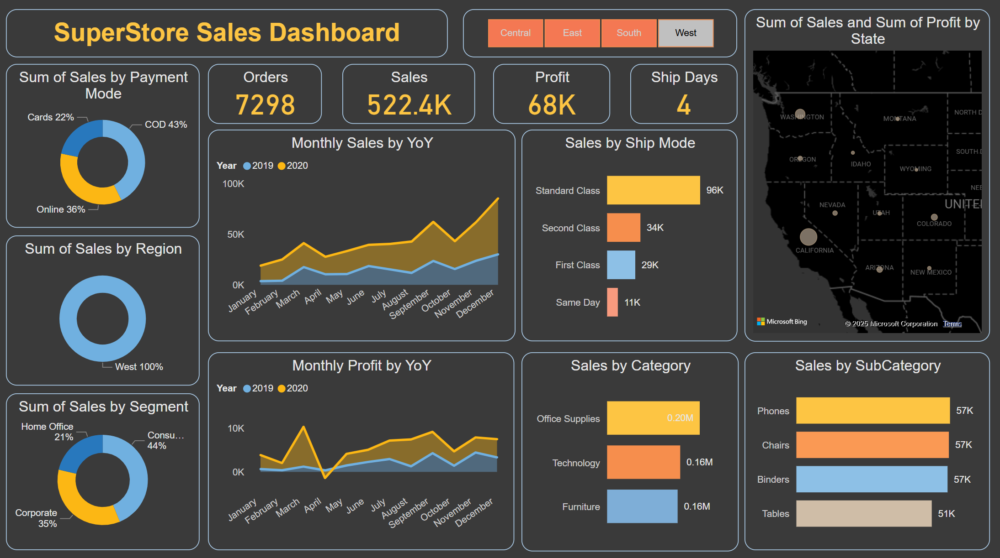
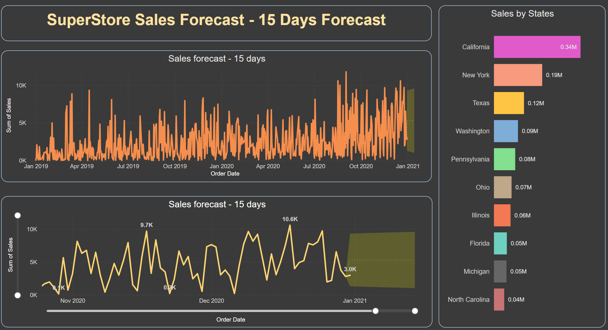

# 📊 Superstore Sales Insights & Forecasting Dashboard (Power BI)

A dynamic and interactive Power BI dashboard analyzing Superstore sales performance, customer behavior, and forecasting future sales trends to enable data-driven business strategies.

---

## 🚀 Features
- **Sales Performance Analysis:** Total sales, profits, and discounts across regions, categories, and customer segments.
- **Top Products & Categories:** Identify best-selling products and categories contributing to revenue.
- **Customer Insights:** Segmentation of customers based on sales and profitability.
- **Regional Trends:** Visual breakdown of sales by states and cities with map visuals.
- **Time Series Forecasting:** Predict future sales using historical data trends and forecasting models.
- **Interactive Filters:** Dynamic slicers for region, category, sub-category, and time period selection.

---

## 📂 Project Structure
```
/Superstore-Sales-Dashboard
    ├── Superstore_Sales_Insights.pbix
    ├── DataSources/
          └── Superstore_Data.xlsx
    └── Screenshots/
          ├── dashboard_preview.png
    ├── README.md
```

---

## 📸 Dashboard Preview

### Sales Overview


### Forecasting Future Sales


---

## 🛠️ Tools & Technologies
- **Power BI Desktop**
- **Power Query Editor** (for data cleaning and transformation)
- **DAX** (for calculated measures and KPIs)
- **Time Series Forecasting Models** (built-in Power BI forecasting visuals)

---

## 📈 How to Use
1. Download the `Superstore_Sales_Insights.pbix` file.
2. Open it using Power BI Desktop.
3. Explore the dashboard and interact with different filters to uncover insights.
4. Review the forecast section for predicted sales trends based on historical data.

